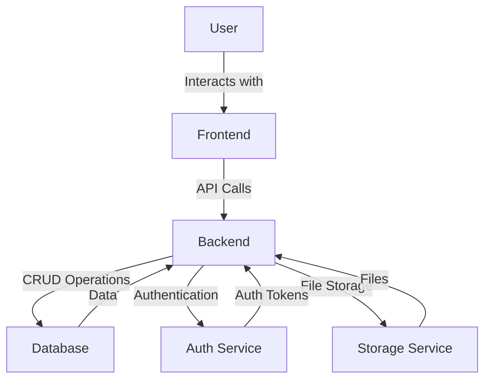
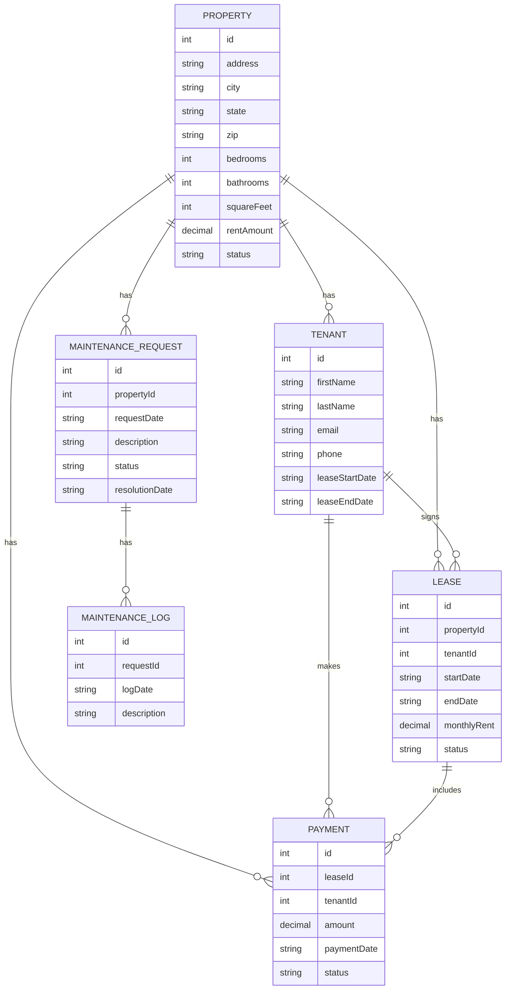
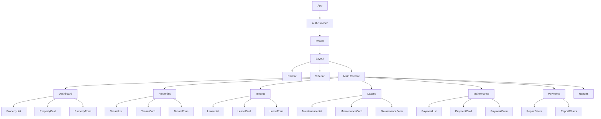
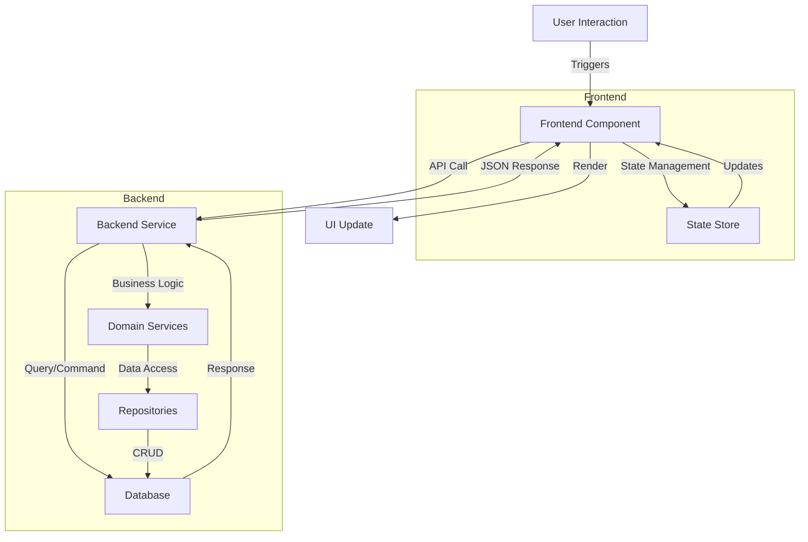
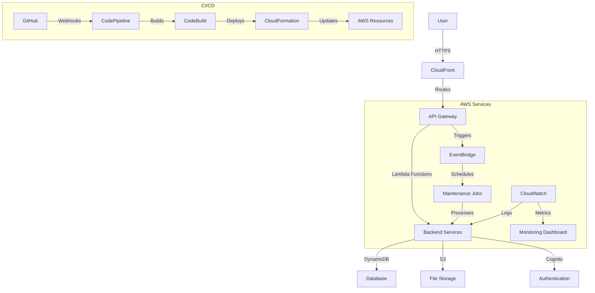

# Rental Property Tracking App - Architectural Diagrams

## 1. System Architecture Overview



## 2. Database Schema Visualization



## 3. API Endpoint Mapping

```mermaid
flowchart TD
    subgraph API Endpoints
        A[/properties] -->|GET| B[List all properties]
        A -->|POST| C[Create property]
        A -->|GET /:id| D[Get property details]
        A -->|PUT /:id| E[Update property]
        A -->|DELETE /:id| F[Delete property]

        G[/tenants] -->|GET| H[List all tenants]
        G -->|POST| I[Create tenant]
        G -->|GET /:id| J[Get tenant details]
        G -->|PUT /:id| K[Update tenant]
        G -->|DELETE /:id| L[Delete tenant]

        M[/leases] -->|GET| N[List all leases]
        M -->|POST| O[Create lease]
        M -->|GET /:id| P[Get lease details]
        M -->|PUT /:id| Q[Update lease]
        M -->|DELETE /:id| R[Delete lease]

        S[/maintenance] -->|GET| T[List all requests]
        S -->|POST| U[Create request]
        S -->|GET /:id| V[Get request details]
        S -->|PUT /:id| W[Update request]
        S -->|DELETE /:id| X[Delete request]

        Y[/payments] -->|GET| Z[List all payments]
        Y -->|POST| AA[Create payment]
        Y -->|GET /:id| AB[Get payment details]
        Y -->|PUT /:id| AC[Update payment]
        Y -->|DELETE /:id| AD[Delete payment]

        AE[/auth] -->|POST /login| AF[Login]
        AE -->|POST /register| AG[Register]
        AE -->|POST /logout| AH[Logout]
    end
```

## 4. Frontend Component Hierarchy



## 5. Data Flow Between Components



## 6. AWS Deployment Architecture

